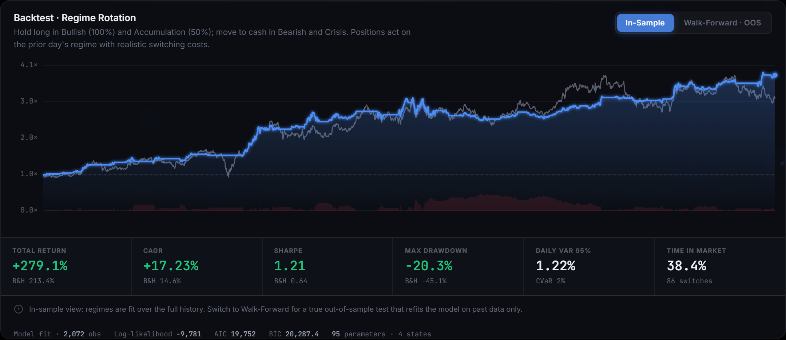

# REGIME

**Classify any equity into one of four hidden market regimes with a Gaussian Hidden Markov Model — then see it, trade it, and stress-test it out-of-sample.** Built India-first for NSE/BSE equities and indices, rendered through a zero-dependency HTML5 Canvas engine where every pixel is drawn by hand.


### ▶ [Live demo → regime-omega.vercel.app](https://regime-omega.vercel.app)

Loads instantly from a precomputed cache; type any ticker (e.g. `INFY.NS`, `AAPL`) for a live fit.


---

## The idea

Markets are non-stationary. A stock spends months grinding higher in a calm uptrend, then a few brutal weeks in a volatility spike, then a long quiet base — and a single set of "average" statistics describes none of those phases well. **REGIME treats the market as a hidden state machine.** A 4-state Gaussian HMM reads daily return, volatility, volume, and momentum and infers which *unobserved* regime the market is in on any given day:

| Regime | Character | Strategy stance |
|---|---|---|
| 🟢 **Bullish Trending** | Positive drift, contained volatility | 100% invested |
| 🔵 **Accumulation** | Near-zero drift, very low volatility — quiet basing | 50% invested |
| 🟠 **Bearish Trending** | Negative drift, elevated volatility | Cash |
| 🔴 **Crisis** | Extreme dispersion, sharp downside — panic | Cash |

The states are discovered unsupervised; a labeler maps each one to a semantic regime by inspecting the learned emission parameters, so the dashboard stays consistent across tickers and reruns.

But a regime label is only worth something if it *predicts* something and *survives* an honest test. So REGIME doesn't stop at classification — it measures the forward edge of each regime, projects crisis risk forward, and runs a **walk-forward, out-of-sample backtest** that refits the model on past data only.

## What's in it

**Modelling**
- **4-state Gaussian HMM** over five engineered features — log return, 5- and 20-day volatility, volume z-score, and 10-day momentum — fit with `hmmlearn`, decoded via Viterbi, with full per-day posterior probabilities.
- **Model diagnostics** — log-likelihood, AIC, and BIC, so the choice of four states is justified rather than asserted.

**Quant signal & risk**
- **Forward-return edge** — for each regime, the average return over the *next* N sessions, with win rate and sample count. The test of whether the classification carries signal, not just hindsight.
- **Crisis early-warning** — today's posterior state distribution propagated through the transition matrix to project the probability of rotating into Crisis over the coming sessions.
- **Walk-forward out-of-sample backtest** — the model is refit on an expanding trailing window (semi-annual cadence), each window standardized on its own statistics, classifying only forward. This is the real credibility test, toggled live against the in-sample view.
- **Tail risk** — daily VaR and CVaR (95%) alongside Sharpe, Sortino, Calmar, and max drawdown.

**India-first data**
- Native handling of NSE (`.NS`), BSE (`.BO`), and Indian indices (`^NSEI`, `^BSESN`, `^NSEBANK`), plus US symbols for comparison. Friendly aliases (`NIFTY` → `^NSEI`) and per-symbol currency rendering (₹ / $).

**Visualization**
- **A custom Canvas renderer, not a charting library.** Candlesticks, the probability field, the transition heatmap, the regime timeline, the equity curve, the forward-edge bars and the crisis gauge are all drawn directly to `<canvas>`/SVG and animated with GSAP. An aurora mesh backdrop and particle field re-tint themselves from the active regime, so the whole interface *feels* the market state.



## How it works

```
   ┌──────────────┐      ┌───────────────────┐      ┌────────────────────┐
   │  DATA LAYER  │      │     ML ENGINE     │      │      FRONTEND      │
   │ yfinance     │─OHLCV│ 5-feature matrix  │states│ Canvas candlesticks│
   │ NSE/BSE/US   │─────►│ Gaussian HMM (EM) │─────►│ probability field  │
   │ validation   │ raw  │ Viterbi decode    │+probs│ transition heatmap │
   │ currency tag │      │ state auto-labeler│      │ equity / edge / gauge
   └──────────────┘      └─────────┬─────────┘      └────────────────────┘
              ┌──────────────┬─────┴──────┬─────────────────┐
              ▼              ▼            ▼                 ▼
        in-sample      walk-forward  forward-return    crisis
        backtest       OOS refit     edge + risk       early-warning
```

The API is three endpoints:

| Endpoint | Returns |
|---|---|
| `GET /api/analyze` | Full pipeline: regimes, probabilities, stats, transition matrix, in-sample backtest, forward edge, crisis warning, diagnostics |
| `GET /api/walkforward` | Out-of-sample walk-forward backtest (heavier; called on demand) |
| `GET /api/presets` | Curated ticker list for the picker |

## Running it

**Local (two commands):**

```bash
pip install -r requirements.txt
python -m uvicorn server:app --port 8050
```

Open **http://localhost:8050**. The dashboard paints instantly from a precomputed example cache, then you can type any symbol for a live fit. Defaults to `RELIANCE.NS`; the **Instant examples** chips (NIFTY 50, SENSEX, S&P 500, Apple) load with zero wait. Try `^NSEI`, `INFY.NS`, `HDFCBANK.NS`, or a US name like `AAPL` — the picker fills in exchange suffixes for you.

**Docker (one command):**

```bash
docker build -t regime . && docker run -p 8050:8050 regime
```

## Deploy the live demo — Vercel (frontend) + Render (backend)

REGIME ships as a split deploy: the zero-build static frontend goes to **Vercel**, the FastAPI server to **Render**. The frontend calls `/api/*`, which Vercel proxies to Render (configured in [`static/vercel.json`](static/vercel.json)) — so there's no CORS to manage and no API URL baked into the JavaScript.

Live: **[regime-omega.vercel.app](https://regime-omega.vercel.app)** (frontend) → `regime-api-eu56.onrender.com` (backend).

**1. Backend → Render**

- New Render **Blueprint** → pick this repo. Render reads [`render.yaml`](render.yaml) and provisions a free Python web service (`pip install -r requirements.txt`, `uvicorn server:app --host 0.0.0.0 --port $PORT`, health check on `/api/presets`). No environment variables are required — REGIME has **no secrets** (it reads only public Yahoo Finance data).
- Copy the service's public URL once the first deploy goes live. `autoDeploy` is on, so every push to `main` redeploys.

**2. Frontend → Vercel**

- Edit [`static/vercel.json`](static/vercel.json) and replace the `destination` host with your backend URL. Commit.
- Deploy the **`static/` directory** as the Vercel project root (CLI: `cd static && vercel --prod`; or in the dashboard set **Root Directory** to `static`). Vercel detects no framework and serves the static files, proxying `/api/*` to Render. Deploying from `static/` keeps Vercel from mistaking the repo-root Python files for a backend.
- The site loads instantly from the committed static data bundle; live ticker queries hit Render.

> **The demo does not depend on the backend being awake.** [`static/data/`](static/data) holds the ticker presets, the example-chip metadata, and the five precomputed showcase analyses as plain JSON. `app.js` reads those first, so first paint is sub-second even on a cold (or dead) backend, and only a live fit for a non-showcase ticker touches `/api`. Regenerate the bundle with `python scripts/build_cache.py && python scripts/build_static_data.py` (no API key needed) and commit it.

> **Why not the whole app on Vercel?** Each live analysis fits an HMM on the fly (~10–25s), which exceeds Vercel's serverless timeout, and the `scikit-learn`/`scipy`/`hmmlearn` stack overflows the bundle limit. The server wants a box that stays warm. Render / Railway / Fly / Heroku all work (`render.yaml`, `Procfile`, `Dockerfile` are included). Note that a free-tier box sleeps when idle — the static bundle above is what keeps the demo instant regardless.

## About the backtest

The strategy maps each regime to a target exposure (100% Bullish, 50% Accumulation, 0% Bearish/Crisis), acts on the **prior day's** regime (a one-bar lag, no lookahead), and pays a realistic round-trip cost (5 bps) on every switch. Two views:

- **In-Sample** — the HMM is fit once over the full history. Fast, but the regime labels have seen the whole series. A diagnostic, not a track record.
- **Walk-Forward · OOS** — the model is refit on past data only and classifies forward. This is the honest test. On `RELIANCE.NS` (split at the eve of the 2020 crash) the rotation strategy went to cash through the crash and finished the out-of-sample window ahead of buy-and-hold on return, Sharpe, *and* drawdown — but expect the edge to vary by name, and sometimes to give up return for a much smoother ride. That variance is the point: it's measured, not assumed.

## Notes on yfinance & Indian coverage

- NSE and BSE equities resolve cleanly with `.NS` / `.BO` suffixes; large-cap history typically goes back well over a decade.
- **Indices often report zero or missing volume** on Yahoo (`^NSEI`, `^BSESN`). REGIME tolerates this — the volume z-score degrades gracefully rather than erroring.
- Yahoo data is adjusted-close based and occasionally has gaps around corporate actions or holidays; the data layer forward-fills small gaps and rejects series with more than 5% missing prices.
- A minimum of **two years** of history is required to fit the HMM; walk-forward needs **three-plus**.

## Project layout

```
regime/
├── static/
│   ├── index.html     # Shell, design system, layout
│   └── app.js         # Canvas engine, animations, quant panels
├── config.py          # Single source of truth: params, palette, presets, costs
├── data.py            # yfinance ingestion, ticker/currency handling, validation
├── features.py        # Five-feature engineering (+ raw matrix for walk-forward)
├── model.py           # HMM fit, Viterbi decode, state labeling, regime stats
├── backtest.py        # In-sample + walk-forward backtests, performance metrics
├── analytics.py       # Forward edge, crisis early-warning, model diagnostics
├── server.py          # FastAPI endpoints (+ cache-aware /api/analyze, /api/examples)
├── cache.py           # Precomputed example cache (instant first paint + resilience)
├── cache/             # Committed analysis payloads for the showcase tickers
├── scripts/
│   └── build_cache.py # Regenerate the cache from live yfinance data (no key)
├── static/vercel.json # Vercel static-frontend config + /api proxy to Render
├── Dockerfile · render.yaml · Procfile   # frictionless backend deploy
└── requirements.txt
```

## Roadmap

- **Regime-conditional position sizing** beyond the long/flat exposure map (e.g. volatility targeting).
- **Cross-asset regimes** — fit on an index and overlay individual names.
- **Intraday and crypto support** — adapt the features for 24/7 markets.

## License

MIT — see [LICENSE](LICENSE).
