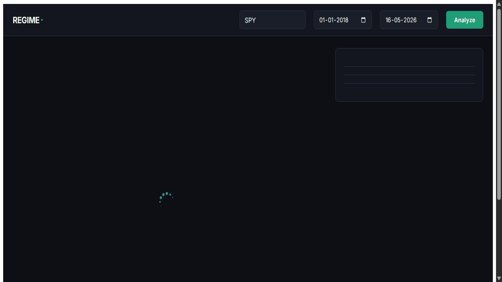
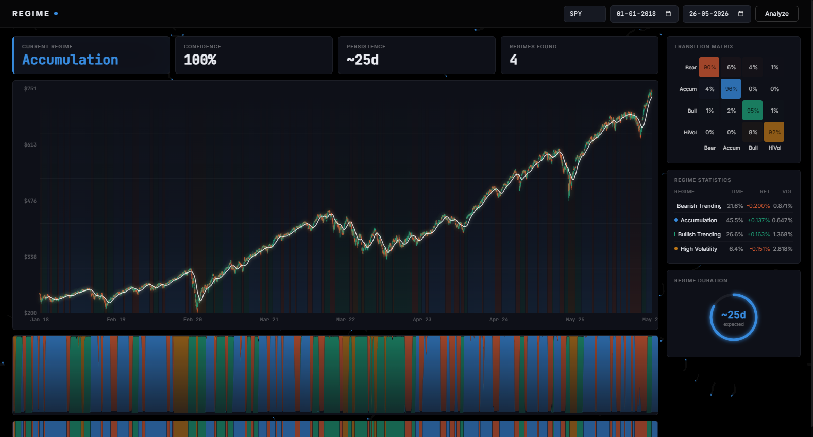
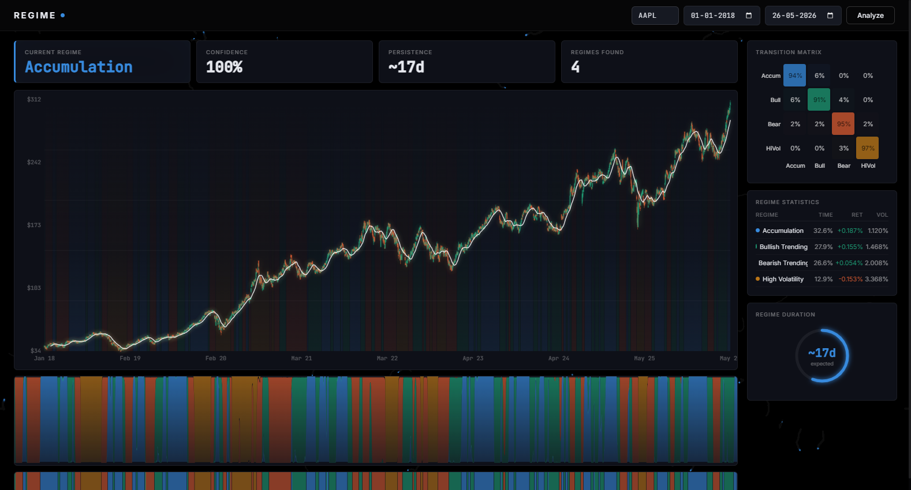

# REGIME

**Detect hidden market regimes in any US stock using a 4-state Hidden Markov Model.** Rendered as a living, breathing Canvas-based visualization.




<details>
<summary><b>📸 More Screenshots</b></summary>
<br>

| Dashboard (SPY) | Dashboard (AAPL) |
|---|---|
|  |  |

</details>

---

## The Problem

Financial markets are non-stationary systems. Trends, volatility, and trading behaviors shift over time, yet traditional quantitative strategies often treat market dynamics as static. Standard indicators (like moving averages or Bollinger Bands) lag significantly and fail to capture the underlying transition between structural market phases (e.g., transitioning from low-volatility accumulation to a high-volatility liquidity crisis). 

## The Solution

**REGIME** models market dynamics as a Hidden Markov Process. By analyzing daily return distributions and volatility profiles, it reveals the hidden states governing price action in real-time. Instead of presenting this data in dry tabular formats, REGIME visualizes the market as a living organism. Using a custom high-performance HTML5 Canvas renderer, it showcases regime shifts through ambient particle movements, gradient-bleeding transition zones, and oscillating probability bands.

---

## Features

- **4-State Gaussian HMM** — Automatically classifies market behavior into four statistically distinct regimes:
  - 🟢 **State 0 (Bullish Momentum)**: High positive returns, low volatility.
  - 🔴 **State 1 (Bearish Decline)**: Negative returns, elevated volatility.
  - ⚡ **State 2 (High-Volatility Crisis)**: Extreme return dispersion, sharp downside pressure.
  - 🟡 **State 3 (Quiet Accumulation/Consolidation)**: Near-zero returns, extremely low volatility.
- **Dynamic Particle Field** — An ambient background particle simulation where particle velocity, turbulence, and color spectrum are bound directly to the current market regime.
- **Gradient Regime Bleeding** — Visualizes regime transition zones on the main candlestick chart as smooth, bleeding gradients rather than blocky dividers, mirroring the continuous nature of market transitions.
- **Oscillating Probability Bands** — Displays HMM state confidence as breathing probability zones beneath the price action, adding organic micro-animations that reflect statistical uncertainty.
- **Cascading Candlestick Renderer** — Renders hundreds of daily price candles using native Canvas rendering with staggered entry animations powered by GSAP.
- **Interactive Transition Heatmap** — Renders the HMM's internal transition matrix as an interactive grid, illustrating the probability of shifting from one market state to another.
- **Timeline Film-Strip Strip** — A compressed horizontal minimap of historical regime classifications allowing quick scrolling and overview of year-scale cycles.

---

## Tech Stack

- **Backend**: FastAPI (Python 3.11+) + Uvicorn
- **Frontend**: Vanilla HTML5 Canvas API + CSS variables + GSAP (no heavy JS frameworks or charting libraries)
- **Machine Learning**: `hmmlearn` (Gaussian HMM), `scikit-learn`, `pandas`, `numpy`
- **Data Source**: `yfinance` (Yahoo Finance API)

---

## Quick Start

### Prerequisites

- Python 3.10+
- A modern web browser supporting Canvas and ES6 Javascript

### Installation & Run

1. **Clone the repository:**
   ```bash
   git clone https://github.com/shreyasfegade/regime.git
   cd regime
   ```

2. **Install dependencies:**
   ```bash
   pip install -r requirements.txt
   ```

3. **Launch the server:**
   ```bash
   python -m uvicorn server:app --port 8050
   ```

4. **Access the dashboard:**
   Open [http://localhost:8050](http://localhost:8050) in your browser.

---

## Architecture

```text
regime/
├── .ai-docs/               # Archived original AI specs (ignored by git)
├── static/
│   ├── index.html          # Shell layout, CSS styles, and typography
│   └── app.js              # Canvas charts, HMM visualizer, particle engine
├── config.py               # Theme colors, styling tokens, and constants
├── data.py                 # Yahoo Finance data ingestion & validation
├── features.py             # Feature engineering (returns, range volatility)
├── model.py                # HMM model training, decoding, and state auto-labeling
├── server.py               # FastAPI server and analysis endpoints
├── requirements.txt        # Python dependency manifest
├── LICENSE                 # MIT License
└── README.md               # Project documentation
```

---

## Current Status

This project is a **functional experimental prototype**. 

- **Implemented**: Daily data parsing, statistical feature engineering (daily return and close-to-close log range volatility), Gaussian HMM fitting, auto-labeling of decoded states, API endpoint delivery, and full interactive dashboard rendering.
- **In Progress**: Real-time ticker validation, expanding transition matrix tooltips with exact probabilities.
- **Planned**: Support for crypto and commodity tickers (adapting features for 24/7 markets), regime persistence forecasting models.

---

## Architecture

```
┌─────────────────┐         ┌─────────────────┐         ┌─────────────────┐
│   DATA LAYER    │         │   ML ENGINE     │         │    FRONTEND     │
│                 │         │                 │         │                 │
│ • Yahoo Finance │────────►│ • Feature Eng.  │────────►│ • Canvas API    │
│ • Daily OHLCV   │  raw    │ • Gaussian HMM  │ states  │ • GSAP Tweens   │
│ • 1yr history   │  prices │ • State Labeler │ + probs │ • Crosshairs    │
│                 │         │ • Transition Mx │         │ • Heatmap       │
└─────────────────┘         └─────────────────┘         └─────────────────┘
```

### Data Flow

```
1. Ticker submitted (e.g., "SPY")
   ↓
2. Yahoo Finance fetched ─────────────── ~800ms (1yr daily OHLCV)
   ↓
3. Features computed ──────────────────── ~50ms (log returns + range volatility)
   ↓
4. 4-state Gaussian HMM fitted ───────── ~200ms (Expectation-Maximization)
   ↓
5. States auto-labeled ────────────────── ~10ms (ranked by μ_return, μ_volatility)
   ↓
6. Canvas rendered ────────────────────── ~30ms (candlesticks + overlays + heatmap)

Total: ~1.1s from ticker input to full visualization
```

`hmmlearn` assigns state indices (0–3) randomly on each training run. The post-training labeler ranks states by mean return and mean volatility, mapping them to semantic profiles (Bullish, Bearish, High-Volatility, Accumulation) so the dashboard stays consistent across tickers.

The frontend uses native Canvas instead of SVG to avoid DOM overhead at high element counts. GSAP tweens feed directly into the canvas redraw loop at 60fps.

---

## Limitations

- **US Equity Focus**: Designed primarily around daily close data for US stocks; indicators may behave differently on index assets or commodity assets.
- **Random Initializations**: Gaussian Mixture and Hidden Markov Models are sensitive to starting coordinates; rarely, edge cases in volatile stock histories can result in ambiguous state mapping.
- **Historical Scope**: Requires a minimum of 1 year of historical data to fit the HMM parameters reliably.

---

## What This Project Taught Me

- How Hidden Markov Models classify sequential data into latent states, and why unsupervised state labeling is non-trivial.
- Why Canvas rendering outperforms SVG for high-density financial chart visualizations.
- How feature engineering (log returns, range volatility) transforms raw price data into model-ready inputs.
- The architecture of serving ML model outputs through low-latency API endpoints.

## Development Note

**Built with AI-assisted development.** I directed the product vision, designed the UX, and made the key architecture decisions. AI tools accelerated the implementation.

My contributions:
- The core idea: applying Hidden Markov Models to market regime detection and visualizing it as a living organism.
- UX direction: particle fields reacting to market state, gradient-bleeding regime transitions, organic probability bands.
- Architecture: choosing pure Canvas rendering over charting libraries, and the heuristic framework for consistent state labeling.
- Iterating on the dashboard layout, color semantics, and interaction design.

---

## License

This project is licensed under the MIT License - see the [LICENSE](LICENSE) file for details.
